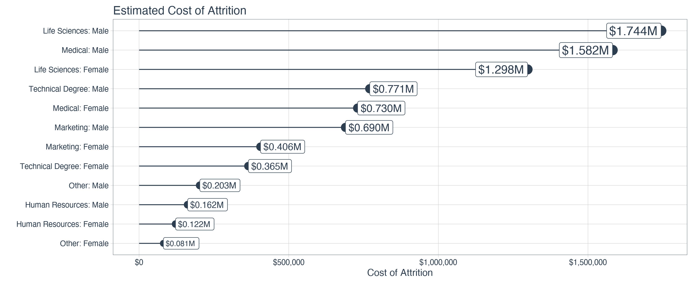

#  Department Summary - Table 


```{r tbl1, echo = FALSE}
tbl1 <- tibble::tribble(
~`Educationfield`, ~`Gender`, ~`Attrition`, ~`N`, ~`Pct`, ~`Above Industry Avg`, ~`Cost Of Attrition`,
"Human Resources","Female","Yes","3","37.50%","Yes","$121,700",
"Technical Degree","Male","Yes","19","27.14%","Yes","$770,767",
"Human Resources","Male","Yes","4","26.67%","Yes","$162,267",
"Marketing","Male","Yes","17","21.79%","Yes","$689,633",
"Technical Degree","Female","Yes","9","20.45%","Yes","$365,100",
"Marketing","Female","Yes","10","17.54%","Yes","$405,667",
"Medical","Male","Yes","39","16.32%","Yes","$1,582,100",
"Life Sciences","Female","Yes","32","15.38%","Yes","$1,298,133",
"Life Sciences","Male","Yes","43","13.78%","Yes","$1,744,367",
"Medical","Female","Yes","18","11.76%","Yes","$730,200",
"Other","Male","Yes","5","11.11%","Yes","$202,833",
"Other","Female","Yes","2","9.52%","Yes","$81,133"
)

kableExtra::kable_styling(knitr::kable(tbl1), font_size = 18)
```


---
#  Department Summary - Plot 



